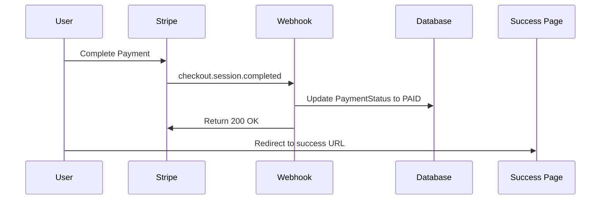
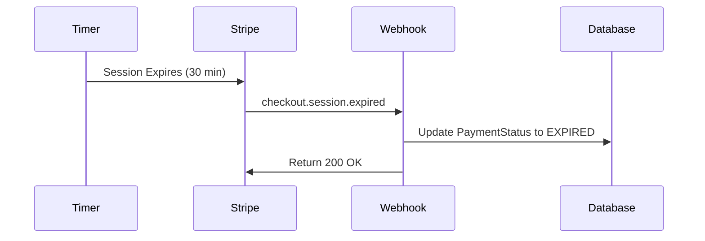

# Stripe Webhook Integration Guide

## Overview

This guide explains how to integrate Stripe webhooks with your application to automatically update payment statuses in the database when payments are completed, expired, or failed.

## Features Implemented

### 1. Payment Success & Cancel URLs

- **Success URL**: `/api/v1/stripe/success?session_id={CHECKOUT_SESSION_ID}`
- **Cancel URL**: `/api/v1/stripe/cancel?session_id={CHECKOUT_SESSION_ID}`

These endpoints display user-friendly static pages with:

- Success confirmation with session details
- Cancel notification with retry options
- Auto-close functionality
- Responsive design
- Branded styling

### 2. Enhanced Webhook Handler

The webhook controller now automatically updates payment status in the database for:

- ✅ **Payment Completed** (`checkout.session.completed`)
- ⏰ **Payment Expired** (`checkout.session.expired`)
- ❌ **Payment Failed** (`payment_intent.payment_failed`)
- 💰 **Refunds** (`charge.refunded`)

## Stripe Webhook Setup Instructions

### Step 1: Create Webhook Endpoint in Stripe Dashboard

1. **Login to Stripe Dashboard**
   - Go to [Stripe Dashboard](https://dashboard.stripe.com)
   - Navigate to **Developers** → **Webhooks**

2. **Add New Endpoint**
   - Click **"Add endpoint"**
   - Enter your webhook URL: `https://yourdomain.com/api/v1/stripe/webhook`
   - For local development: Use ngrok or similar tool

### Step 2: Configure Webhook Events

Select the following events to listen for:

```
✅ checkout.session.completed
⏰ checkout.session.expired
💳 payment_intent.succeeded
❌ payment_intent.payment_failed
💰 charge.refunded
```

### Step 3: Get Webhook Secret

1. After creating the webhook, copy the **Signing Secret**
2. Add it to your environment variables:

```bash
STRIPE_WEBHOOK_SECRET=whsec_your_webhook_secret_here
```

### Step 4: Configure Success/Cancel URLs (Optional)

Set custom URLs in your environment:

```bash
STRIPE_SUCCESS_URL=https://yourdomain.com/api/v1/stripe/success?session_id={CHECKOUT_SESSION_ID}
STRIPE_CANCEL_URL=https://yourdomain.com/api/v1/stripe/cancel?session_id={CHECKOUT_SESSION_ID}
```

## Local Development Setup

### Using ngrok for Local Webhooks

1. **Install ngrok**

   ```bash
   npm install -g ngrok
   # or
   brew install ngrok
   ```

2. **Expose Local Server**

   ```bash
   # Start your NestJS app on port 3000
   npm run start:dev

   # In another terminal, expose port 3000
   ngrok http 3000
   ```

3. **Configure Webhook URL**
   - Copy the ngrok HTTPS URL (e.g., `https://abc123.ngrok.io`)
   - Use as webhook endpoint: `https://abc123.ngrok.io/api/v1/stripe/webhook`

### Testing Webhooks Locally

1. **Test Webhook Delivery**

   ```bash
   # Use Stripe CLI to forward webhooks
   stripe listen --forward-to localhost:3000/api/v1/stripe/webhook
   ```

2. **Trigger Test Events**
   ```bash
   # Trigger a test checkout.session.completed event
   stripe trigger checkout.session.completed
   ```

## Webhook Event Flow

### Payment Completion Flow



### Payment Expiration Flow



## Database Updates

When webhooks are received, the system automatically:

1. **Finds the payment link** by `stripeCheckoutSessionId`
2. **Updates payment status** to appropriate status:
   - `PAID` for successful payments
   - `EXPIRED` for expired sessions
   - `FAILED` for failed payments
3. **Stores webhook metadata** for audit trail
4. **Logs all events** for debugging

## Testing the Integration

### 1. Test Success/Cancel Pages

```bash
# Test success page
curl "http://localhost:3000/api/v1/stripe/success?session_id=cs_test_123"

# Test cancel page
curl "http://localhost:3000/api/v1/stripe/cancel?session_id=cs_test_123"
```

### 2. Test Webhook Processing

```bash
# Create a payment session first
curl -X POST http://localhost:3000/api/v1/session/stop \
  -H "Content-Type: application/json" \
  -d '{"sessionId": "your-session-id", "finalCost": 5.00}'

# Then trigger webhook events via Stripe CLI
stripe trigger checkout.session.completed
```

### 3. Verify Database Updates

Check the payment_links table to confirm status updates:

```sql
SELECT
    id,
    session_id,
    stripe_checkout_session_id,
    status,
    amount,
    expires_at,
    created_at,
    updated_at
FROM payment_links
WHERE session_id = 'your-session-id'
ORDER BY created_at DESC;
```

## Production Considerations

### Security

- ✅ Webhook signature verification implemented
- ✅ HTTPS required for production webhooks
- ✅ Environment-based configuration

### Monitoring

- ✅ Comprehensive logging for all webhook events
- ✅ Error handling for failed database updates
- ✅ Stripe webhook delivery monitoring in dashboard

### Performance

- ✅ Efficient database queries using checkout session ID
- ✅ Non-blocking webhook processing
- ✅ Proper error responses to Stripe

## Troubleshooting

### Common Issues

1. **Webhook Not Receiving Events**
   - Verify webhook URL is accessible
   - Check Stripe webhook logs in dashboard
   - Ensure HTTPS in production

2. **Signature Verification Failed**
   - Verify `STRIPE_WEBHOOK_SECRET` is correct
   - Check raw body is being passed to webhook

3. **Database Not Updating**
   - Check application logs for errors
   - Verify payment link exists in database
   - Check database connection

### Debug Commands

```bash
# Check webhook endpoint health
curl -X POST http://localhost:3000/api/v1/stripe/webhook

# View application logs
npm run start:dev

# Test Stripe connectivity
stripe auth
stripe events list --limit 5
```

## Environment Variables Summary

```bash
# Required
STRIPE_SECRET_KEY=sk_test_your_stripe_secret_key
STRIPE_WEBHOOK_SECRET=whsec_your_webhook_secret

# Optional (defaults provided)
STRIPE_SUCCESS_URL=https://yourdomain.com/api/v1/stripe/success?session_id={CHECKOUT_SESSION_ID}
STRIPE_CANCEL_URL=https://yourdomain.com/api/v1/stripe/cancel?session_id={CHECKOUT_SESSION_ID}
STRIPE_ENABLE_CARD_PAYMENTS=true
```

## API Endpoints Summary

| Method | Endpoint                 | Description                        |
| ------ | ------------------------ | ---------------------------------- |
| POST   | `/api/v1/stripe/webhook` | Webhook receiver for Stripe events |
| GET    | `/api/v1/stripe/success` | Payment success page               |
| GET    | `/api/v1/stripe/cancel`  | Payment cancel page                |

This integration ensures that payment statuses are automatically synchronized between Stripe and your database, providing a seamless experience for users and reliable payment tracking for your application.
